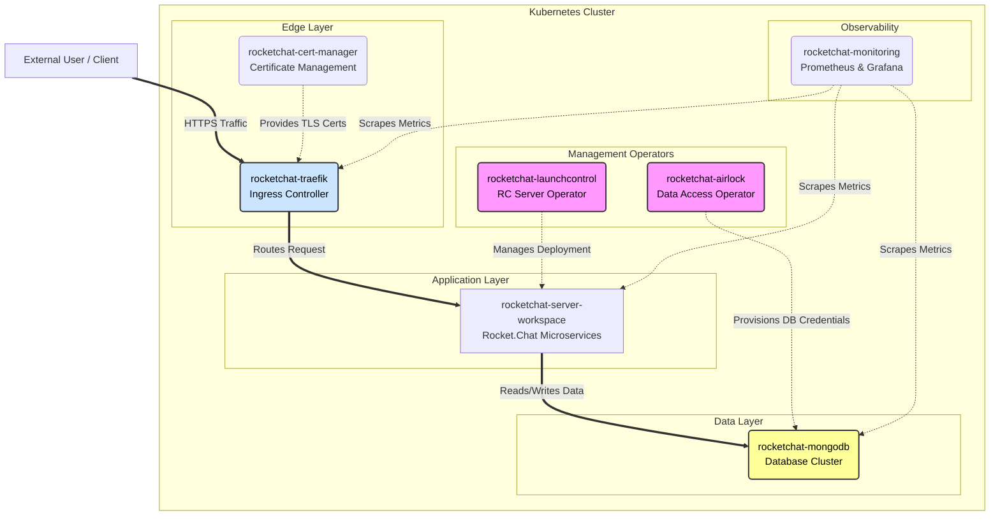

# Rocket.Chat Zarf Packages

This repository contains a collection of **Zarf packages** designed to deploy and manage a complete Rocket.Chat ecosystem in air-gapped or restricted environments.
Zarf is an open-source tool designed to simplify the delivery of software into air-gapped, secure, or highly regulated environments by bundling all necessary dependencies into [packages](https://docs.zarf.dev/ref/packages/).

## Verifying packages

Write our public key to a file (`rc-zarf.pub`):
```
-----BEGIN PUBLIC KEY-----
MFkwEwYHKoZIzj0CAQYIKoZIzj0DAQcDQgAEGRlNyEmY/vgPSXrlPvOZbp1xeCPg
6M7EC9Ojs5IT5QD0n3+XCexASrnRLQ2NWJscOKBhVoybjeSpSY/sAImuDQ==
-----END PUBLIC KEY-----
```

Then:
```
zarf package verify oci://ghcr.io/rocketchat/<package-name>:<package-version> --key rc-zarf.pub
```
You can also [deploy with signature verification](https://docs.zarf.dev/tutorials/5-package-signing-and-verification/#step-6-deploy-with-signature-verification).

## Deploying packages

It is recommended that your Kubernetes cluster contains  at least 3 nodes with 2 vCPUs, 6 GiB memory and 100G disk each.
For testing, you can decrease storage and mongod limits. There's a README.md in each package folder with variables and defaults.

### Requirement: init the cluster

```
KUBECONFIG=<kubeconfig> zarf init [--storage-class longhorn] [--confirm]
```

If there's no reliable storage class in the target cluster, init with what you have, then:
```
KUBECONFIG=<kubeconfig> zarf package deploy zarf-package-rocketchat-longhorn-*.tar.zst --components migrate-registry --confirm # move to longhorn
```

### Deploying

Deploy in order:
- monitoring (requires a storage class)
- traefik
- cert-manager
- mongodb-kubernetes (requires a storage class)
- airlock
- launchcontrol (requires airlock)
- server-workspace (requires launchcontrol)

#### High-level architectural diagram



---

## Developers: Getting Started

Most likely you'll need a lab setup.
There's a guide for developing Zarf packages https://rocketchat.atlassian.net/wiki/spaces/RnD/pages/756842503/Developing+Rocket.Chat+Zarf+packages

---

That's all for now, folks!
